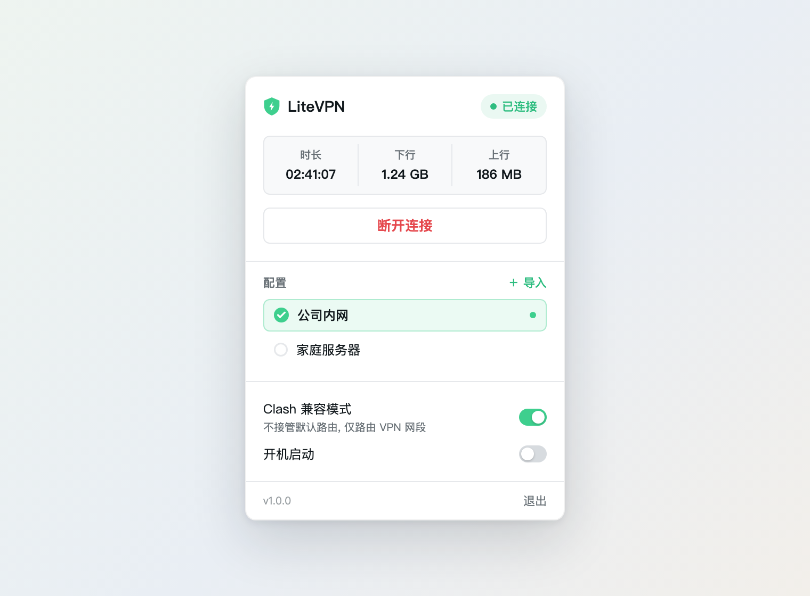

# LiteVPN

**English** | [简体中文](README.zh-CN.md)


A minimal, lightweight **OpenVPN menu bar client for macOS** — built as an alternative to the bulky OpenVPN Connect. Instant to open, light on memory, with no account system, no push notifications, and no update popups.

100% Swift, powered by [TunnelKit](https://github.com/partout-io/tunnelkit) — the pure-Swift OpenVPN protocol implementation that drives the open-source client Passepartout.

<p align="center"></p>

## Features

- **Lives in the menu bar** (no Dock icon), one-click connect / disconnect
- **.ovpn import**: drag & drop onto the panel or use the file picker, validated at import time, multiple profiles
- **Live status**: connection duration, download / upload traffic
- **Clash Compatible Mode**: leaves the default route alone so it coexists with Clash TUN / system proxy (see below)
- **Auto-reconnect** on drops (built into TunnelKit), optional **Launch at Login**
- Tunnel runs in a separate Network Extension process — quitting the app keeps the connection alive
- Localized UI: English & 简体中文 (follows system language)
- Supabase-style light interface

Deliberately minimal: only certificate-embedded profiles (inline `<ca>` / `<cert>` / `<key>`) are supported. No username/password authentication.

## Coexisting with Clash

Conflicts between VPN clients and Clash come down to **who owns the routing table**. With Clash Compatible Mode enabled:

- LiteVPN does not take over the default route; it only claims the specific subnets from your profile and server-pushed routes (e.g. `10.0.0.0/8`)
- Traffic to VPN subnets goes through the OpenVPN tunnel; everything else flows through Clash as usual (TUN mode or system proxy)
- The routing table arbitrates by longest-prefix match — the two virtual interfaces never fight

Recommended Clash-side configuration:

```yaml
rules:
  - IP-CIDR,<your-vpn-server-ip>/32,DIRECT   # keep the VPN handshake out of the proxy
```

If you access intranet services by domain name, add those domains to Clash's `fake-ip-filter`.

## Architecture

```
┌─────────────────────────┐      ┌──────────────────────────────┐
│ LiteVPN.app (menu bar)  │      │ LiteVPNTunnel.appex          │
│ SwiftUI MenuBarExtra    │─────▶│ NEPacketTunnelProvider       │
│ NetworkExtensionVPN     │ NE   │ └─ TunnelKit OpenVPN engine  │
│ profiles/status/traffic │◀─────│    (protocol + data channel) │
└─────────────────────────┘ AppGroup └──────────────────────────┘
```

- The protocol engine surface is kept deliberately small (tunnel subclass + parser + connection manager), leaving room for a future WireGuard engine
- TunnelKit v6.3.2 is vendored at `Vendor/tunnelkit/` with WireGuard stripped (upstream is archived and its wireguard-apple dependency repo was deleted, so remote references are no longer reliable) — see [Vendor/tunnelkit/LITEVPN-MODIFICATIONS.md](Vendor/tunnelkit/LITEVPN-MODIFICATIONS.md)
- The crypto layer is pinned to the OpenSSL **3.5 LTS** line (supported until April 2030) via `.upToNextMinor`, so dependency resolution only picks up 3.5.x patch releases and never drifts onto a short-lived release line

## Building

Requirements: Xcode (full install), [XcodeGen](https://github.com/yonaskolb/XcodeGen) (`brew install xcodegen`), and a paid Apple Developer account (required for the Network Extension capability).

1. **Use your own signing identity** (two places):
   - `project.yml` → set `DEVELOPMENT_TEAM` to your Team ID
   - `App/AppConstants.swift` → update the Team ID prefix in `appGroup`
2. Generate the project and build:

```bash
xcodegen generate
open LiteVPN.xcodeproj   # Run in Xcode; automatic signing creates the profiles
```

Or from the command line:

```bash
xcodebuild -project LiteVPN.xcodeproj -scheme LiteVPN \
  -allowProvisioningUpdates -allowProvisioningDeviceRegistration build
```

On first connect macOS will ask to add a VPN configuration — allow it once.

> **No prebuilt binary is shipped.** A macOS Network Extension app can't be distributed in a form that runs on arbitrary Macs without per-machine signing, so building from source with your own Apple Developer account (about 5 minutes) is the supported path.

## Usage

1. Click the shield icon in the menu bar
2. Drag in your `.ovpn` file (or click "+ Import")
3. Hit **Connect**

## Credits

- [TunnelKit](https://github.com/partout-io/tunnelkit) by Davide De Rosa — OpenVPN protocol engine
- [OpenSSL](https://github.com/partout-io/openssl-apple) — crypto layer (3.5 LTS)

## License

[GPL-3.0](LICENSE) (inherited from the TunnelKit engine).

## Author

云中江树 (yzfly) · WeChat Official Account: 云中江树
